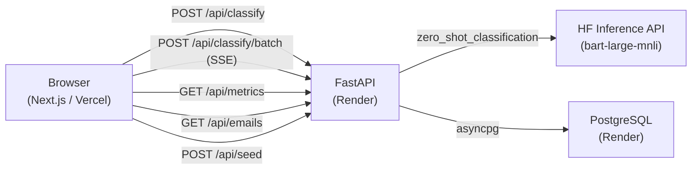

# AutoU Email Classifier

Aplicacao web que utiliza inteligencia artificial para classificar emails como Produtivo ou Improdutivo e sugerir respostas automaticas em portugues.

---

## Demo

| Servico | URL |
|---------|-----|
| Frontend | `https://[seu-projeto].vercel.app` |
| API (Swagger) | `https://[seu-projeto].onrender.com/docs` |

> **Render cold start:** O backend no Render (free tier) pode levar ate 1-2 minutos para iniciar na primeira requisicao. A interface exibe um indicador de carregamento enquanto aguarda.

> **Dados demo:** Clique em "Carregar dados demo" no cabecalho para popular o dashboard com 40 emails de exemplo.

---

## Arquitetura



**Componentes:**

- **Frontend:** Next.js 16 com Tailwind CSS v4, TanStack Query v5, Recharts v3 e shadcn/ui v4
- **Backend:** FastAPI com SQLAlchemy 2.0 async, Pydantic v2 e Alembic para migracoes
- **IA:** Hugging Face Inference API — modelo `facebook/bart-large-mnli` para classificacao zero-shot
- **Banco:** PostgreSQL no Render (free tier), acesso via asyncpg

---

## Selecao do Modelo

O modelo escolhido foi `facebook/bart-large-mnli`, um modelo de linguagem pre-treinado para classificacao zero-shot via inferencia de linguagem natural (NLI). O BART-large-MNLI avalia se um texto de entrada e consistente com cada rotulo candidato ("produtivo", "improdutivo") usando a relacao de implicacao logica (entailment vs. contradiction). Isso elimina a necessidade de fine-tuning com dados rotulados — basta definir os rotulos em linguagem natural.

Embora o modelo tenha sido treinado em ingles (MNLI dataset), ele transfere bem para portugues porque os padroes de NLI sao fundamentalmente linguisticos, nao lexicais. Na pratica, o modelo identifica estruturas de solicitacao, acao requerida e urgencia em emails financeiros em PT-BR com acuracia satisfatoria para o contexto deste case.

A API de Inferencia do Hugging Face (remota) foi escolhida em vez de execucao local porque o Render free tier oferece apenas 512 MB de RAM, e o bart-large-mnli requer aproximadamente 1,6 GB em memoria para carregamento. A HF Inference API executa o modelo na infraestrutura de GPU do HuggingFace sem custo adicional. A contrapartida e a latencia de cold start: na primeira requisicao o modelo pode levar 20-60 segundos para carregar, retornando status 503. O backend trata esse erro com mensagem em PT-BR e instrucao para o usuario aguardar e tentar novamente.

---

## Funcionalidades

- Classificacao individual de email via texto livre ou upload de arquivo `.txt` / `.pdf`
- Classificacao em lote com progresso em tempo real via SSE (Server-Sent Events)
- Sugestao de resposta automatica em PT-BR baseada na classificacao
- Dashboard com metricas: total classificado, distribuicao por categoria, serie temporal diaria e historico paginado
- Tema escuro corporativo com alternancia claro/escuro
- Dados demo pre-carregaveis para avaliacao imediata (40 emails distribuidos em 30 dias)
- Notificacoes toast em todas as operacoes assincronas
- Estados vazios com chamada para acao no dashboard

---

## Configuracao Local

### Pre-requisitos

- Python 3.11+
- Node.js 18+ e pnpm
- PostgreSQL (local ou remoto)
- Token da Hugging Face API — gratuito em [huggingface.co/settings/tokens](https://huggingface.co/settings/tokens)

### Backend

```bash
cd backend
python -m venv venv
source venv/bin/activate  # Windows: venv\Scripts\activate
pip install -r requirements.txt
cp .env.example .env      # edite com DATABASE_URL e HF_API_KEY
alembic upgrade head
uvicorn app.main:app --reload --port 8000
```

A documentacao interativa da API estara disponivel em `http://localhost:8000/docs`.

### Frontend

```bash
cd frontend
pnpm install
cp .env.example .env.local  # defina NEXT_PUBLIC_BACKEND_URL=http://localhost:8000
pnpm dev
```

O frontend estara disponivel em `http://localhost:3000`.

### Variaveis de Ambiente

| Variavel | Servico | Descricao |
|----------|---------|-----------|
| `DATABASE_URL` | Backend | String de conexao PostgreSQL (`postgres://...` ou `postgresql://...`) |
| `HF_API_KEY` | Backend | Token da Hugging Face Inference API |
| `ALLOWED_ORIGINS` | Backend | Array JSON de origens permitidas por CORS (ex: `["http://localhost:3000"]`) |
| `NEXT_PUBLIC_BACKEND_URL` | Frontend | URL do backend — embutida no bundle em tempo de build |

> **Nota:** `NEXT_PUBLIC_BACKEND_URL` e injetada no bundle JavaScript durante o `next build`. Apos alterar essa variavel no Vercel, e necessario acionar um novo deploy para que a mudanca entre em vigor.

---

## Stack Tecnologico

| Componente | Tecnologia |
|------------|------------|
| Frontend | Next.js 16, React 19 |
| Estilos | Tailwind CSS v4, shadcn/ui v4 |
| Estado e cache | TanStack Query v5 |
| Graficos | Recharts v3 |
| Backend | FastAPI |
| ORM / Migracoes | SQLAlchemy 2.0 async, Alembic |
| Validacao | Pydantic v2 |
| IA | Hugging Face Inference API, `facebook/bart-large-mnli` |
| Banco de dados | PostgreSQL |
| Deploy frontend | Vercel |
| Deploy backend + DB | Render (free tier) |

---

## Limitacoes Conhecidas

- **Cold start do Render:** O backend no free tier entra em suspensao apos 15 minutos de inatividade. A primeira requisicao pode levar 1-2 minutos enquanto o servidor reinicia. A interface exibe um indicador de carregamento durante esse periodo.
- **Expiracao do PostgreSQL:** O banco de dados gratuito do Render expira apos 30 dias. O botao "Carregar dados demo" permite repopular os dados apos recriacao do banco — o schema e recriado automaticamente via `alembic upgrade head` no startup.
- **Cold start do modelo HF:** Na primeira classificacao apos um periodo sem uso, o modelo pode retornar erro 503 enquanto esta sendo carregado na infraestrutura do HuggingFace. Aguarde aproximadamente 30 segundos e tente novamente.
- **Classificacao zero-shot:** O modelo nao foi treinado especificamente para emails financeiros em portugues. A acuracia pode variar para textos muito curtos ou com linguagem ambigua.

---

## Estrutura do Projeto

```
autou/
├── backend/
│   ├── app/
│   │   ├── classification/   # Classificacao via HF API
│   │   ├── emails/           # Modelo Email (SQLAlchemy)
│   │   ├── extraction/       # Extracao de texto (.txt, .pdf)
│   │   ├── health/           # Endpoint de health check
│   │   ├── metrics/          # Metricas e historico
│   │   ├── seed/             # Dados demo
│   │   ├── config.py         # Configuracoes (env vars)
│   │   ├── database.py       # Engine + session async
│   │   └── main.py           # App FastAPI + routers
│   ├── alembic/              # Migracoes de banco
│   └── requirements.txt
└── frontend/
    └── src/
        ├── app/              # Pages (Next.js App Router)
        ├── components/       # Componentes React
        ├── hooks/            # Hooks customizados (TanStack Query)
        └── lib/              # Utilitarios
```
