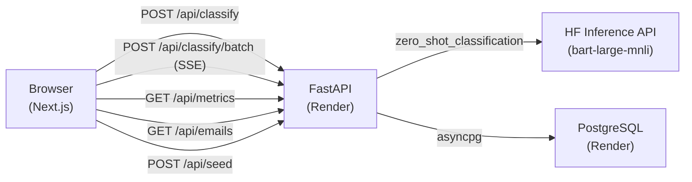

# Crivo

Desafio técnico para o processo seletivo da [AutoU](https://autou.com.br). A proposta era construir uma aplicação que classifica emails como produtivos ou improdutivos usando inteligência artificial e sugere respostas contextuais.

O resultado é o **Crivo** — uma aplicação web com backend em FastAPI e frontend em Next.js que usa o modelo `facebook/bart-large-mnli` (via Hugging Face Inference API) para classificação zero-shot de emails em português.

## Demo

| Serviço | URL |
|---------|-----|
| Frontend | https://crivo-web.onrender.com |
| API (Swagger) | https://crivo-api.onrender.com/docs |

O backend roda no free tier do Render, então a primeira requisição pode levar 1-2 minutos (cold start). A interface mostra um indicador de carregamento enquanto aguarda.

Para ver o dashboard populado, clique em **Seed** no cabeçalho — carrega 40 emails de exemplo distribuídos em 30 dias.

## Arquitetura



- **Frontend:** Next.js 16, React 19, Tailwind CSS v4, TanStack Query v5, Recharts v3, shadcn/ui v4
- **Backend:** FastAPI, SQLAlchemy 2.0 async, Pydantic v2, Alembic
- **IA:** Hugging Face Inference API com `facebook/bart-large-mnli` para classificação zero-shot
- **Banco:** PostgreSQL no Render (free tier), acesso via asyncpg

## Por que o bart-large-mnli

O `facebook/bart-large-mnli` é um modelo pré-treinado para classificação zero-shot via inferência de linguagem natural (NLI). Ele avalia se um texto é consistente com cada rótulo candidato ("produtivo", "improdutivo") usando a relação de implicação lógica — entailment vs. contradiction. Não precisa de fine-tuning nem de dados rotulados, basta definir os rótulos em linguagem natural.

O modelo foi treinado em inglês (MNLI dataset), mas transfere razoavelmente para português porque os padrões de NLI são mais estruturais do que léxicos. Na prática, ele identifica estruturas de solicitação, ação requerida e urgência em emails financeiros em PT-BR com acurácia suficiente para este contexto.

A API de Inferência do Hugging Face (remota) foi escolhida porque o Render free tier oferece 512 MB de RAM e o bart-large-mnli precisa de ~1,6 GB para rodar localmente. A contrapartida é a latência de cold start: na primeira requisição o modelo pode levar 20-60 segundos para carregar, retornando 503. O backend trata esse erro com mensagem em PT-BR.

## O que a aplicação faz

- Classificação individual de email via texto livre ou upload de `.txt` / `.pdf`
- Classificação em lote com progresso em tempo real via SSE (Server-Sent Events)
- Detecção de emails automáticos (noreply, "não responda este email") com ação interna sugerida em vez de resposta
- Sugestões de resposta contextuais por tipo de email (solicitação, proposta, reclamação, agendamento, negociação)
- Extração de entidades do corpo do email (valores, datas, nomes) para personalizar sugestões
- Dashboard com métricas: total classificado, distribuição por categoria, série temporal diária e histórico paginado
- 40 emails de exemplo pré-carregáveis para avaliação imediata
- Tema escuro corporativo

## Configuração local

### Pré-requisitos

- Python 3.11+
- Node.js 18+ e pnpm
- PostgreSQL (local ou remoto)
- Token da Hugging Face API — gratuito em [huggingface.co/settings/tokens](https://huggingface.co/settings/tokens)

### Backend

```bash
cd backend
python -m venv venv
source venv/bin/activate  # Windows: venv\Scripts\activate
pip install -r requirements.txt
cp .env.example .env      # edite com DATABASE_URL e HF_API_KEY
alembic upgrade head
uvicorn app.main:app --reload --port 8000
```

Documentação interativa da API em `http://localhost:8000/docs`.

### Frontend

```bash
cd frontend
pnpm install
cp .env.example .env.local  # defina NEXT_PUBLIC_BACKEND_URL=http://localhost:8000
pnpm dev
```

Frontend em `http://localhost:3000`.

### Variáveis de ambiente

| Variável | Serviço | Descrição |
|----------|---------|-----------|
| `DATABASE_URL` | Backend | String de conexão PostgreSQL |
| `HF_API_KEY` | Backend | Token da Hugging Face Inference API |
| `ALLOWED_ORIGINS` | Backend | Array JSON de origens CORS (ex: `["http://localhost:3000"]`) |
| `NEXT_PUBLIC_BACKEND_URL` | Frontend | URL do backend, embutida no bundle em tempo de build |

`NEXT_PUBLIC_BACKEND_URL` é injetada no bundle JavaScript durante o `next build`. Depois de alterar essa variável, é necessário um novo deploy.

## Stack

| Camada | Tecnologia |
|--------|------------|
| Frontend | Next.js 16, React 19 |
| Estilos | Tailwind CSS v4, shadcn/ui v4 |
| Estado e cache | TanStack Query v5 |
| Gráficos | Recharts v3 |
| Backend | FastAPI |
| ORM / Migrações | SQLAlchemy 2.0 async, Alembic |
| Validação | Pydantic v2 |
| IA | Hugging Face Inference API, `facebook/bart-large-mnli` |
| Banco de dados | PostgreSQL |
| Deploy | Render (backend + DB + frontend, free tier) |

## Limitações conhecidas

- **Cold start do Render:** o free tier suspende o backend após 15 min de inatividade. A primeira requisição pode levar 1-2 min. A interface mostra um indicador de carregamento.
- **PostgreSQL do Render:** o banco gratuito expira em 30 dias. O botão Seed repopula os dados após recriação — o schema é recriado via `alembic upgrade head` no startup.
- **Cold start do modelo HF:** na primeira classificação após inatividade, o modelo pode retornar 503 enquanto carrega nos servidores do HuggingFace. Aguarde ~30 segundos e tente de novo.
- **Classificação zero-shot:** o modelo não foi treinado para emails financeiros em português especificamente. A acurácia pode variar para textos muito curtos ou ambíguos.

## Estrutura do projeto

```
crivo/
├── backend/
│   ├── app/
│   │   ├── classification/   # Classificação via HF API + sugestões inteligentes
│   │   ├── emails/           # Modelo Email (SQLAlchemy)
│   │   ├── extraction/       # Extração de texto (.txt, .pdf)
│   │   ├── health/           # Health check
│   │   ├── metrics/          # Métricas e histórico
│   │   ├── seed/             # Dados demo (40 emails)
│   │   ├── config.py         # Configurações (env vars)
│   │   ├── database.py       # Engine + session async
│   │   └── main.py           # App FastAPI + routers
│   ├── alembic/              # Migrações de banco
│   └── requirements.txt
└── frontend/
    └── src/
        ├── app/              # Pages (Next.js App Router)
        ├── components/       # Componentes React
        ├── hooks/            # Hooks customizados (TanStack Query)
        └── lib/              # Utilitários
```
